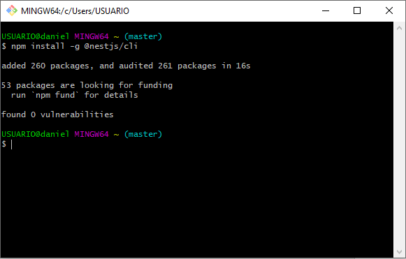
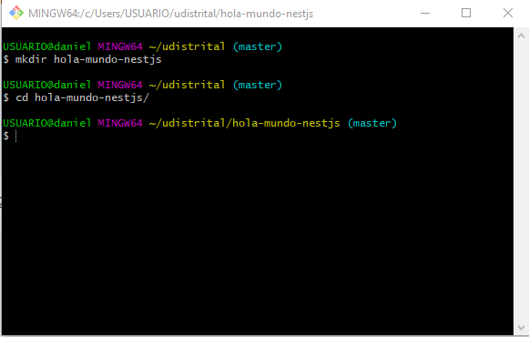
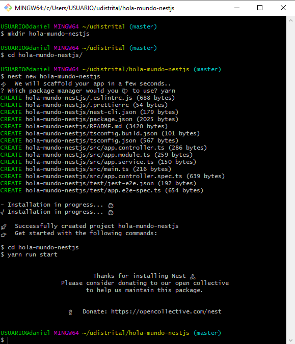
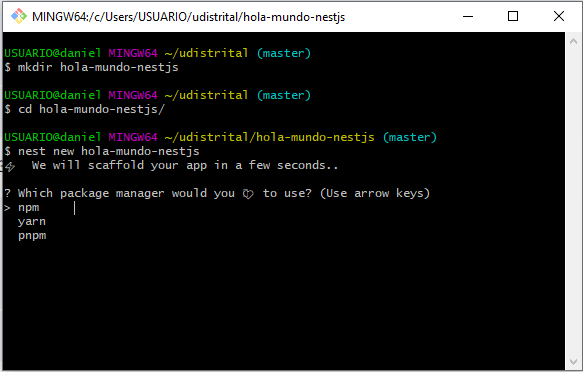
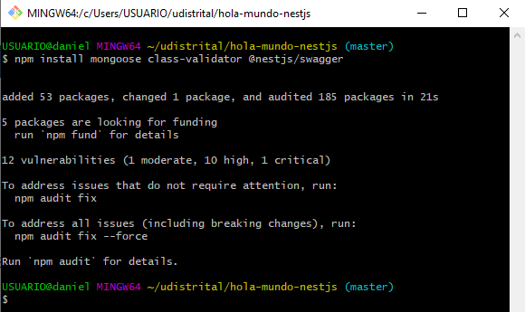
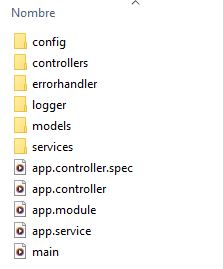

<p align="center">
  
</p>

<h1 align="center"><b>Documentación para la generación y definición de la estructura de proyecto en APIs con base de datos no relacionales (MongoDB) bajo la tecnología NestJs</b></h1>

---

### Introducción

Este documento tiene como objetivo establecer los lineamientos para la generación y definición de la estructura de proyecto en APIs con base de datos no relacionales (MongoDB) bajo la tecnología NestJs. Se detallan las subtareas necesarias para la creación de una API robusta y escalable.

---

### 1. Generación del API (Uso del CLI)

#### Creación del proyecto NestJs:

- Instalar el CLI de NestJs globalmente, Utilizar el comando `npm install -g @nestjs/cli`.



- Crear un nuevo directorio para el proyecto:



- Inicializar el proyecto NestJs:

<div>
    
    
</div>

#### Instalación de dependencias:

- Instalar las dependencias necesarias para trabajar con MongoDB en NestJs, como `npm install mongoose class-validator @nestjs/swagger`.



---

### 2. Configuración de variables de entorno

- Creación de un archivo `.env`

Ejemplo:

```shell
HORARIOS_CRUD_DB=[nombre de la base de datos]
HORARIOS_CRUD_PASS=[password del usuario]
HORARIOS_CRUD_HOST=[direccion de la base de datos]
HORARIOS_CRUD_PORT=[Puerto de conexión con la base de datos]
HORARIOS_CRUD_USER=[usuario con acceso a la base de datos]
HORARIOS_CRUD_AUTH_DB=[base de datos de autorizacion]
HORARIOS_CRUD_HTTP_PORT=[puerto de ejecucion]
```

### 3. Refactorización del proyecto para manejar controlador, modelos y servicios

Organizar el código del proyecto en carpetas separadas para controladores, modelos y servicios.

```shell
+---src
|   |   app.controller.spec.ts
|   |   app.controller.ts
|   |   app.module.ts
|   |   app.service.ts
|   |   main.ts
|   |
|   +---config
|   +---controllers
|   +---errorhandler
|   +---logger
|   +---models
|   \---services
```

Ejemplo:



Dentro del controlador se debe tener en cuenta la estructura de respuesta:
```nestjs
type APIResponse struct {
	Success bool        `json:"success"`
	Status  int         `json:"status"`
	Message interface{} `json:"message"`
	Data    interface{} `json:"data"`
}
```

---

### 4. Manejo de error, filtros (query), logger, healtcheck

---

### 5. Generación de swagger y detalle de .drone para despliegue

---
