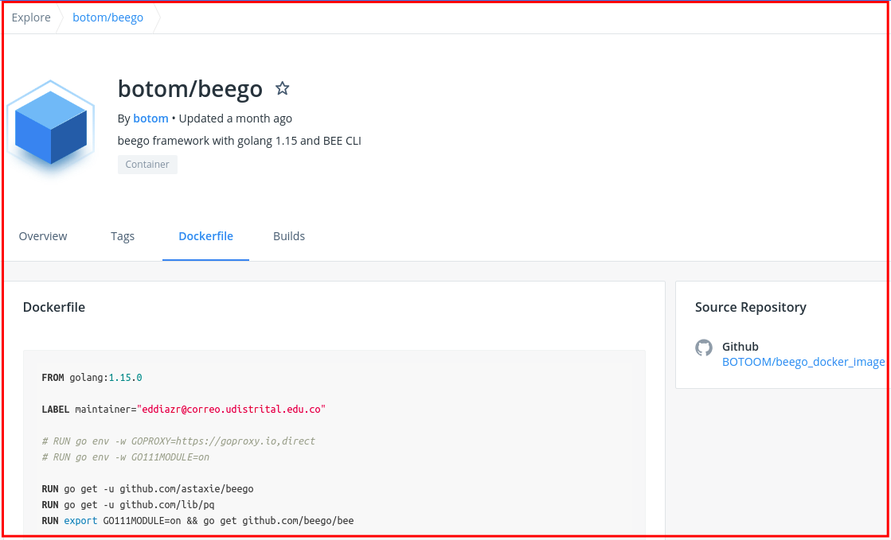

# Instalación Beego y Bee

## Requerimientos
1. [Instalación Golang](golang.md)

## Instalación en Ambiente local

### 1. Instalar git
```bash
# Para SO basados en Debian
sudo apt-get install git
# Para SO basados en Red Hat
sudo yum install git -y
```

### 2. Instalación Beego y Bee

#### 2.1 Beego

##### 2.1.1 Beego ultima version
```bash
go get -u github.com/astaxie/beego
```

##### 2.1.2 Beego V1.12.1 (Versión Funcional para OAS)
```bash
cd $GOPATH
mkdir -p src/github.com/astaxie
cd src/github.com/astaxie
wget https://github.com/astaxie/beego/archive/v1.12.1.tar.gz
tar -xzvf *.tar.gz
mv beego-1.* beego
cd beego/
go get
go install
```
#### 2.2 Bee
```bash
# Instalar bee
GO111MODULE="on" go get -u github.com/beego/bee
```
#### 2.3 GO111MODULE
**Nota**: Agregamos un apartado para el manejo de GO111MODULE
```bash
# Comando para consultar variable del sistema:  
env

# Definir variables
export GO111MODULE=on

# Eliminiar variables
unset GO111MODULE

========

# Comando para consultar variable de golang:
 go env

# Definir variables
go env -w GO111MODULE=on

# Eliminiar variables
go env -w GO111MODULE=""
```


## Instalación en Ambiente Dockerizado

### 1. Instalar herramienas de contenedores:   
[Docker](https://docs.docker.com/engine/install/ubuntu/)   
[Docker compose](https://docs.docker.com/compose/install/)

### 2. Implementar imagen [Docker Hub](https://hub.docker.com/r/botom/beego):   
La imagen puede ser usada para los diferentes desarrollos en go y para sustituir aquellos desarrollos existentes que ya tienen docker-compose, facilitando el tiempo de compilacion por parte del orquestador.



### 3.Uso de recetas:   

#### Dockerfile
```Dockerfile
FROM botom/beego
WORKDIR /go/src
```

#### docker-compose.yml
```yml
version: '3.4'

services:
  api:
    build: ./bee_build # directorio de archivo Dockerfile del ejemplo anterior
    image: ${SERVICE_NAME} # nombre del servicio , es customizable , se recomienda el nombre del api
    container_name: ${SERVICE_NAME}
    volumes:
      - gosrc:/go
      - .:/go/src/github.com/udistrital/${API_NAME} #Nombre del api
    env_file: # archivos de variables de entorno para facil customizacion de las variables
      - custom.env
      - .env
    ports:
      - "${API_PORT}:${API_PORT}" #poerto del api
    command: sh -c 'cd github.com/udistrital/${API_NAME};go get -v ./...; bee migrate -driver=postgres -conn="postgres://${POSTGRES_USER}:${POSTGRES_PASSWORD}@${POSTGRES_HOST}/${POSTGRES_DB}?sslmode=disable&search_path=public" || true; bee run -downdoc=true -gendoc=true' #variables de coneccion a la base de datos
```

## Comprobar instalacion
```bash
$ bee version

| ___ \
| |_/ /  ___   ___
| ___ \ / _ \ / _ \
| |_/ /|  __/|  __/
\____/  \___| \___| v1.10.0

├── Beego     : 1.11.1
├── GoVersion : go1.11.5
├── GOOS      : linux
├── GOARCH    : amd64
├── NumCPU    : 1
├── GOPATH    : /home/virtual/go
├── GOROOT    : /usr/local/go
├── Compiler  : gc
└── Date      : Wednesday, 20 Feb 2019
```
