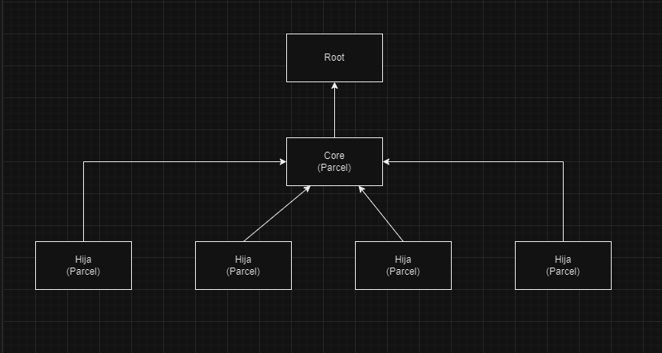

# Introducción al Core microfrontend

El Core de los Microfrontends es el componente central la aplicación, encargándose de manejar la configuración general y proporcionar funcionalidades compartidas a todos los Microfrontends que componen la aplicación. Este Core desacopla la lógica común de la aplicación de los Microfrontends individuales, promoviendo así la reutilización del código y la consistencia en toda la aplicación.

El Core es transversal a cualquier aplicación que se desarrolle en la oficina. Es el elemento base para dar funcionalidad a los desarrollos de clientes. 

## Características:

<ul>
<li>Gestión del estado de la aplicación general</li>
<li>Configuración e inicialización</li>
<li>Gestión del enrutamiento</li>
<li>Manejo de autenticación y autorización</li>
<li>Gestión de librerías compartidas</li>
<li>Compartir recursos generales a otros mf</li>
</ul>

## Cómo definir rutas de mf hijos

### Configuración root

1. Debemos establecer en la aplicación root que el core sea el microcliente padre y pueda tener control sobre los otros microclientes esto lo hacemos en el microfrontend-layout.html:

```bash
<single-spa-router>

  #En este apartado se define la aplicacion core
  <application name="@course/core"></application>

  #Aqui se ve ejemplo de como definir la ruta base de  un microcliente parcel hijo 
  <route path="material">
    <application name="@course/mf2"></application>
  </route>

  <route path="tercero">
    <application name="@course/mf3"></application>
  </route>

</single-spa-router>
```

### Configuración core:

1. Para lograr que el core sea el encargado de manejar las rutas generales de la aplicación tendremos que importar el módulo empty-route.component.ts, este se genera de manera automática al momento de crear la aplicación en la variable routes, quedando de la siguiente manera: 

```bash
const routes: Routes = [
  {path:'**',component:EmptyRouteComponent},
];
```

2. Se utiliza la propiedad de angular routerLink para poder redireccionar hacia el mf que queremos montar en esa ruta:

```bash
  <button routerLink="/material/iconos" routerLinkActive="active">
        <mat-icon>icons</mat-icon>
      </button>

      <button routerLink="/material/table" routerLinkActive="active">
        <mat-icon>table</mat-icon>
      </button>

```
### Configuración aplicacion hija:

Para la aplicación hija se debe estableser una ruta base, la cual es donde se va invocar este microcliente de la siguiente manera:

1. Se requiere importar los siguientes módulos:

```bash
import { APP_BASE_HREF } from '@angular/common';
import { provideHttpClient, withFetch } from '@angular/common/http';
import { NgModule } from '@angular/core';
import { RouterModule, Routes, provideRouter } from '@angular/router';
import { getSingleSpaExtraProviders } from 'single-spa-angular';
```


2. Ingresamos al app-routing.ts y agregamos el siguiente código:

```bash
imports: [RouterModule.forRoot(routes)],
  exports: [RouterModule],
  providers: [ 
    provideRouter(routes),
    { provide: APP_BASE_HREF, useValue: '/material/' },
    getSingleSpaExtraProviders(),
    provideHttpClient(withFetch()) ]
})
```
Este permite establecer la ruta base de nuestra aplicación.

3. Por último registramos las rutas hijas donde se van a visualizar los componentes:

```bash
const routes: Routes = [
  {
    path:"iconos", 
    component: IconComponent
  },
  {
    path:"table", 
    component: TableComponent
  },
];
```

# Arquitectura:




