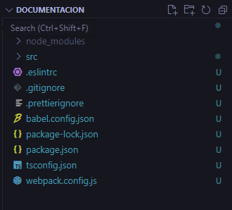

# Aplicación Root:

La aplicación root (o raíz) es una aplicación de alto nivel que actúa como el contenedor principal de todos los microfrontends dentro de la página web (como si fuera un orquestador). Su funcionalidad principal es coordinar la carga, montaje y desmontaje de los microfrontends individuales, así como gestionar la comunicación entre ellos.

<ul>
  <li>Carga de Aplicaciones</li>
  <li>Montaje y Desmontaje</li>
  <li>Gestión de Rutas</li>
  <li>Comunicación entre Microfrontends</li>
  <li>Configuración Global</li>
</ul>

# Creación de Aplicación Root:

Comando para la creación de aplicaciones con Single SPA:

```bash
npx create-single-spa
```
y sleccionaran las siguientes opciones:


```bash
# Se especifica el directorio en el que se desea crear la aplicacion root
? Directory for new project . 

#Se selecciona el tipo de aplicacion a crear en este caso una aplicacion root
? Select type to generate  

 single-spa root config

# Se selecciona el tipo de gestor de paquete de librerias
? Which package manager do you want to
use? 

npm


#Si deseamos usar typescript 
? Will this project use Typescript? 

Yes

#aqui seleccionamos si deseamos que nos cree el archivo layaout 
? Would you like to use single-spa
Layout Engine

 Yes

 # y al final asignamos el nombre de la organizacion que esta desarrollando el proyecto 
? Organization name (can use letters, numbers, dash or underscore) 

course
```

Después de terminar con la creación de la aplicación, la estructura del proyecto quedaría de la siguiente manera:



# Configuracion de Aplicacion root:

## Configurar puerto:

En start actualizamos el puerto, en este caso se coloca el puerto 8080. Archivo packacge.json:

```bash
 "scripts": {
    "start": "webpack serve --port"8080"--env isLocal",
    "lint": "eslint src --ext js,ts,tsx",
    "test": "cross-env BABEL_ENV=test jest --passWithNoTests",
    "format": "prettier --write .",
    "check-format": "prettier --check .",
    "prepare": "husky install",
    "build": "concurrently npm:build:*",
    "build:webpack": "webpack --mode=production",
    "build:types": "tsc"
  },
```

## Angular:

Para poder habilitar el soporte  micro aplicaciones de angular toca habilitar el cdn de zone que se encuentra comentado por defecto, este se encuentra en el archivo: 

index.ejs

```bash
#Se ubicca en la linea 61
  <script src="https://cdn.jsdelivr.net/npm/zone.js@0.11.3/dist/zone.minjs"><script>
```

## Estilos:
Para poder implementar la paleta de colores correspondiente a cada sistema es necesario enlazar la hoja de estilos perteneciente al sistema (SISGPLAN, Polúx, SGA, etc.) que se esta trabajando; este enlace se hace dentro del `<head></head>` de la siguiente manera:

```bash
#Ejemplo de paleta de colores de SISGPLAN
  <link rel="stylesheet" href="https://pruebasassets.portaloas.udistrital.edu.co/gaia-style.css">
```

## Registrar un microfrontend:

index.ejs

Para este proceso ya debemos tener una aplicación pracel previamente creada y configurada, en este apartado se agrega el link en el cual queda levantado el microcliente:

```bash
  <% if (isLocal) { %>
  <script type="systemjs-importmap">
    {
      "imports": {
        "@course/root-config": "//localhost:9000/course-root-config.js",
        "@course/mf1": "http://localhost:4201/main.js"
      }
    }
  </script>
  <% } %>

```

microfrontend-layout.html

Se registra la aplicacion y la ruta en la que va a funcionar. En este ejemplo en la ruta base:

```bash

<single-spa-router>
  <main>
    <route default>
      <application name="@course/mf1"></application>
    </route>
  </main>
</single-spa-router>

```
