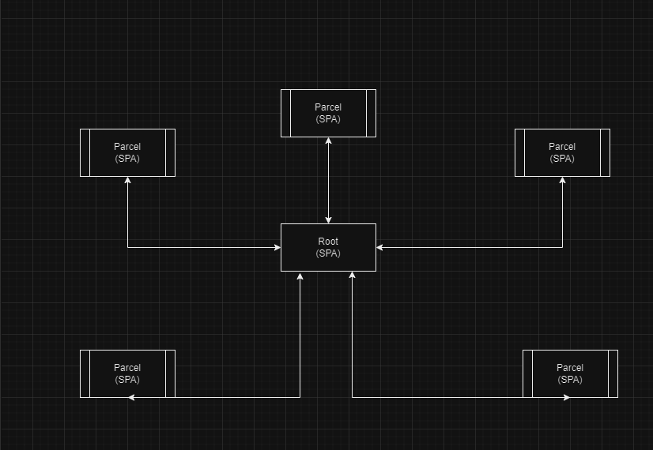

# Introducción:

# ¿Qué es Single SPA?

Single SPA es un (Freamwork) para construir aplicaciones web compuestas por múltiple microfrontends. La idea principal es permitir que diferentes equipos desarrollen y mantengan partes independientes de una aplicación web llamadas microfrontends, de forma separad. Estos pueden ser desarrollados y desplegados en diferentes tecnologías de manera independientes

# ¿Cómo funciona? 

Single Spa actúa como un coordinador que se encarga de cargar y montar los microfrontends en una única página web, proporcionando un mecanismo para la comunicación entre ellos. Los equipos pueden trabajar de manera más eficiente y flexible, ya que pueden desarrollar, probar y desplegar sus microfrontends de forma independiente, sin interferir con otros equipos o partes de la aplicación.

# Ventajas:

- Desarrollo Independiente
- Escalabilidad
- Reutilización de Componentes
- Facilidad de Mantenimiento
- Experimentación y Entrega Continua

Al lograr tener una aplicación web más desagregada, permite y facilita muchos aspectos generales al momento del desarrollo 

# Desventajas:

- Complejidad adicional
- Overhead inicial
- Rendimiento
- Curva de aprendizaje

La complejidad adicional inherente a esta arquitectura puede requerir que los equipos inviertan tiempo en comprender los conceptos fundamentales, las mejores prácticas y la resolución de problemas específicos que puedan surgir durante el desarrollo y la implementación. 

# Freamworks compatibles:

- React
- Vue
- Angular
- Svelth

# Arquitectura 

Documentacion Oficial: https://single-spa.js.org/docs/microfrontends-concept