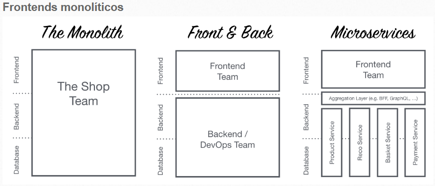
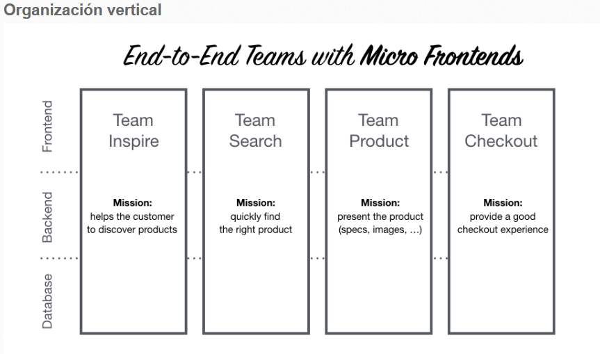

# Introducción:

# ¿Qué es Single SPA?

Single SPA es un framework para construir aplicaciones web compuestas por múltiples microfrontends (microclientes). La idea principal es permitir que diferentes equipos desarrollen y mantengan partes independientes de una aplicación web llamadas microfrontends, de forma separada. Cada uno de los microfrontends pueden ser desarrollados y desplegados en diferentes tecnologías, de forma independiente, sin que se pierda su integración y funcionalidad.

La idea detrás de microfrontends es pensar en un sitio web o aplicación web como una composición de características que son propiedad de equipos independientes. Cada equipo tiene un área de negocio definida o misión de la que se preocupa y se especializa. Un equipo es cross functional y desarrolla sus características end-to-end, desde la base de datos hasta la interfaz de usuario.

# ¿Cómo funciona? 

Single SPA actúa como un coordinador (tipo orquestador) que se encarga de cargar y montar los microfrontends en una única página web, proporcionando un mecanismo para la comunicación entre ellos. Los equipos pueden trabajar de manera más eficiente y flexible, ya que pueden desarrollar, probar y desplegar sus microfrontends de forma independiente, sin interferir con otros equipos o partes de la aplicación.

Para más información, la página oficial de [Single SPA](https://single-spa.js.org/): 

# Ventajas:

- Desarrollo Independiente
- Escalabilidad
- Reutilización de Componentes
- Facilidad de Mantenimiento
- Experimentación y Entrega Continua

Al lograr tener una aplicación web más desagregada, permite y facilita muchos aspectos generales al momento del desarrollo.

# Desventajas:

- Complejidad adicional
- Overhead inicial
- Rendimiento
- Curva de aprendizaje

La complejidad adicional inherente a esta arquitectura puede requerir que los equipos inviertan tiempo en comprender los conceptos fundamentales, las mejores prácticas y la resolución de problemas específicos que puedan surgir durante el desarrollo, la implementación y el despliegue. 

# Frameworks para creación de clientes compatibles:

- React
- Vue
- Angular
- Svelth

# Arquitectura 

# Ideas centrales detrás de los microfrontends

- Ser agnósticos a la tecnología: cada equipo debe poder elegir y actualizar su stack sin tener que coordinar con otros equipos.
- Aislar el código del equipo: no compartir tiempo de ejecución, incluso si todos los equipos usan el mismo framework. Crea aplicaciones independientes que sean autónomas. No hay que confiar en estado compartido o variables globales.
- Evitar la anarquia de frameworks: es especialmente preocupante la tendencia a utilizar esta arquitectura como una excusa para mezclar una variedad de tecnologías, herramientas o frameworks competidores en la misma página, dando lugar a la anarquía de los microfrontends. Una forma particularmente escandalosa de este síndrome consiste en el uso de múltiples frameworks de frontend, como React.js y Angular, en la misma aplicación de página única. Si bien esto puede ser técnicamente posible, no es en absoluto aconsejable, excepto cuando forma parte de una estrategia de transición deliberada.

Para más información sobre [microfrontends](https://micro-frontends-es.org/)

Documentacion Oficial Single-SPA: https://single-spa.js.org/docs/microfrontends-concept
